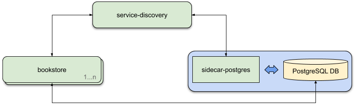

#### Introduction
This is a sample bookstore application.
#### Architecture
The below diagram Illustrates the architecture of the project



Here the components are residing inside docker containers. The following table describes each individual component.

| Component | Description |
| -------- | ----------- |
| bookstore | The main application where the core business logic exists. |
| service-discovery | This is used to preserve/share an application *host* and *port* related information dynamically.
| sidecar-postgres | This is a light weight application which is used to register the *Postgres DB* related *host* and *port* details in *service-discovery* as postgres is not capable of making an API call to *service-discovery* and register itself.
| PostgreSQL DB | This database used throughout the application

>Note: The components *sidecar-postgres* and *PostgreSQL DB* are in the same container.

#### Other Information
The following are the key frameworks/libraries used to create this project
- spring-boot : The underlying framework
- hibernate : Database ORM
- netflix-hystrix : Circuit breaker
- netflix-eureka : Service discovery
- openapi-ui : API spec generator
- mockito/junit : Test cases

### Instructions
Below are the steps to run the project
1) Build the project

```bash
project-root$> mvn clean package
```
2) Build containers ( *here docker-compose is used to manage the multi-container setup* )

```bash
project-root$> docker-compose build
```
3) Start the containers

```bash
project-root$> docker-compose up -d
```

4) Access the application

The main container is linked to the external port 16003. All the Rest APIs can be accessed using the below url

http://localhost:16003/swagger-ui.html


